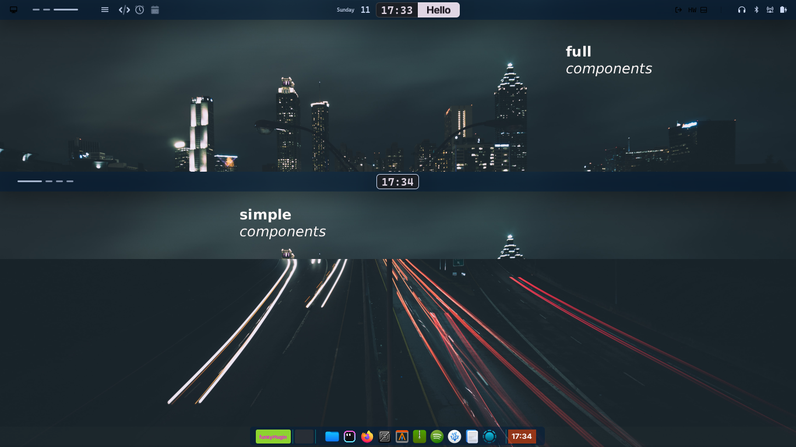

# Omynix Waybar Manager

Intelligent waybar manager for multiple monitors and window managers (Hyprland, Mango, Niri).

## Features

- ✨ Automatic window manager detection
- 🖥️ Differentiated configuration per monitor (full/simple)
- 📝 JSONC template system for easy maintenance
- 🔄 Automatic configuration updates
- 🎨 Single shared stylesheet



## Installation

### With Nix Flakes

```bash
# Enter development environment
nix develop

# Build
cargo build --release

# Install
cargo install --path .
```

### Manual

```bash
# Requirements: Rust 1.70+
cargo build --release
cp target/release/omynix-waybar-manager ~/.local/bin/
```

## Configuration

### 1. Initialize configuration

```bash
omynix-waybar-manager init

# or CLI interactive configuration
omynix-waybar-manager config
```

This creates `~/.local/share/omynix/modules/waybar-manager/config.toml`:

```toml
# defult auto-generated:
[display]                                                                   
  preferred_monitor = ""                                                      
  available_monitors = []                                                     
  mode = "single"     

# example of manual customization
[display]
  preferred_monitor = "HDMI-A-1"
  available_monitors = ["HDMI-A-1", "eDP-1"]
  mode = "multiple"
```

### 2. Create templates

Create the directory:

```bash
mkdir -p ~/.config/waybar/templates
```

Template example (`~/.config/waybar/templates/niri.jsonc`):

```jsonc
[
  {
    // TPL:FULL
    "output": "CONFIGURED_FROM_SCRIPT",
    "layer": "top",
    "position": "top",
    "height": 26,
    "modules-left": ["niri/workspaces", "niri/window"],
    "modules-center": ["clock"],
    "modules-right": ["network", "battery", "tray"]
  },
  {
    // TPL:SIMPLE
    "output": "CONFIGURED_FROM_SCRIPT",
    "layer": "top",
    "position": "top",
    "height": 26,
    "modules-left": ["niri/workspaces"],
    "modules-center": ["clock"],
    "modules-right": []
  }
]
```

**Important**: 
- Comments `// TPL:FULL` and `// TPL:SIMPLE` are required
- `"output": "CONFIGURED_FROM_SCRIPT"` will be replaced with the actual monitor

### 3. Create stylesheet

```bash
# Single shared stylesheet
touch ~/.config/waybar/omynix_style.css
```

## Usage

### Launch waybar

```bash
# Detect monitors, generate configs and launch waybar
omynix-waybar-manager launch

# With more information
omynix-waybar-manager launch --verbose

# Update config without prompting
omynix-waybar-manager launch --force-update
```

### Check configuration

```bash
omynix-waybar-manager check
```

### Configuration

```bash
# configure single/multiple mode & preferred monitor
omynix-waybar-manager config
```

### View detected monitors

```bash
omynix-waybar-manager monitors
```

## File structure

```
~/.config/waybar/
├── templates/
│   ├── hyprland.jsonc      # Templates for Hyprland
│   ├── mango.jsonc         # Templates for Mango
│   └── niri.jsonc          # Templates for Niri
├── generated/              # Generated configs (auto-created)
│   ├── niri_eDP-1_full.json
│   └── niri_HDMI-A-1_simple.json
└── omynix_style.css        # Shared styles

~/.local/share/omynix/waybar-manager/
└── config.toml             # Main configuration
```

## Assignment logic

### Single monitor
- **Any monitor** → `TPL:FULL`

### Multiple monitors
- **Preferred monitor** → `TPL:FULL`
- **Other monitors** → `TPL:SIMPLE`

## Window manager integration

### Hyprland

In `~/.config/hypr/hyprland.conf`:

```conf
exec-once = omynix-waybar-manager launch
```

### Niri

In `~/.config/niri/config.kdl`:

```kdl
spawn-at-startup "omynix-waybar-manager" "launch"
```

### Mango

In your Mango autostart.sh script.
```sh
omynix-waybar-manager launch
```

## Development

```bash
# Enter development environment
nix develop

# Build and run
cargo run -- launch --verbose

# Tests
cargo test

# Watch mode (auto-recompiles)
cargo watch -x run

# Formatting
cargo fmt
```

## Troubleshooting

### "No window manager detected"

Verify that you're running Hyprland, Mango or Niri:

```bash
echo $HYPRLAND_INSTANCE_SIGNATURE  # For Hyprland
pgrep niri                         # For Niri
pgrep mango                        # For Mango
```

### "Template file not found"

Make sure to create the templates in:
- `~/.config/waybar/templates/hyprland.jsonc`
- `~/.config/waybar/templates/mango.jsonc`
- `~/.config/waybar/templates/niri.jsonc`

### Waybar doesn't appear

Check the logs:

```bash
omynix-waybar-manager launch --verbose
journalctl --user -u waybar -f
```

## License

MIT
